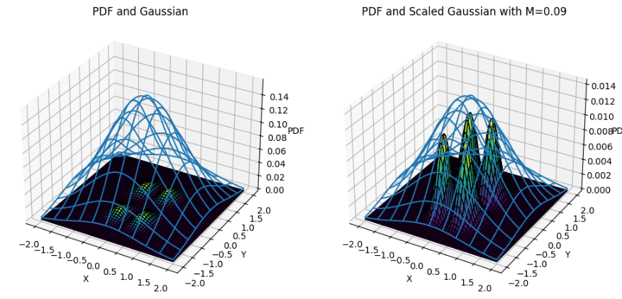
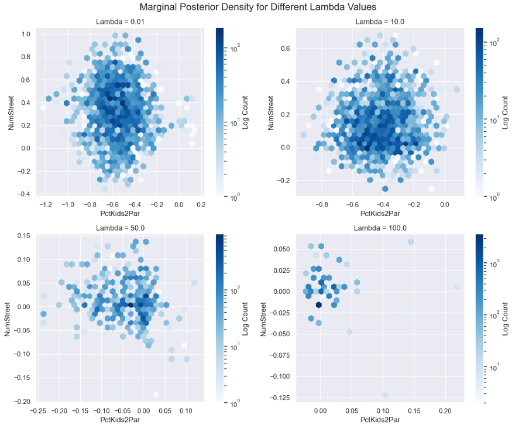
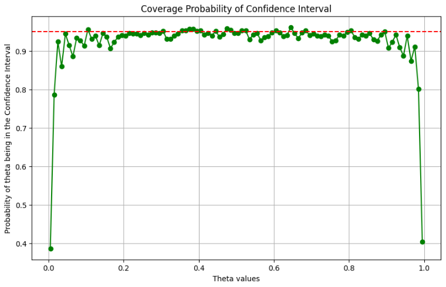

# Statistics Class
 This repository consists of the exercises I did for my Machine Learning class in my first semester of my Master Studies, and the topics that I go over are:
 - Probability Theory
 - Statistical modeling
 - Estimators
 - Test and Confidence intervals
 - Monte Carlo and Markov Chains
 - Bootstrap
 - Jackknife
 - Linear Models
 - Statistical Network analysis
 - etc.

## Example of the plots that I created:

Sampling:

Marginal Posterior Density:

Coverage probability on confidence interval:

